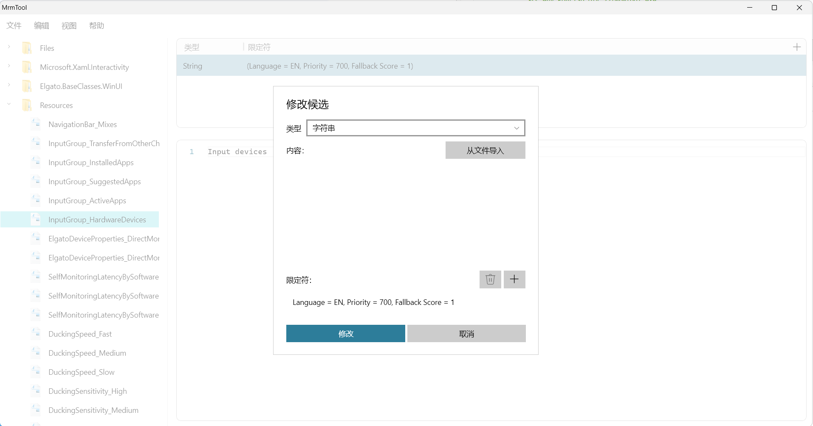

# MrmTool 中文汉化版 [原MrmTool作者](https://github.com/ahmed605/MrmLib)

**MrmTool** 是一个用于查看和编辑 **PRI** 文件的工具，它允许你创建、修改和删除 **PRI** 资源，同时还可以预览它们的内容。

**MrmTool** 依赖于 [MrmLib](https://github.com/ahmed605/MrmLib) 来处理和修改 **PRI** 文件。

它还包含一个 **XBF**（XAML 二进制格式）反编译器（目前还没有重新编译器），它当前使用的是修改版的 [XbfAnalyzer](https://github.com/chausner/XbfAnalyzer)（该修改版基于旧的提交，并非最新版本），不过我们已经[计划](https://github.com/ahmed605/MrmTool/blob/f48c57a23fb1c53ac82dcbd3e9b0418206740dca/MrmTool/PriPage.xaml.cs#L472-L475)将其替换为基于 **WinUI 3** 的 **XBF** 解析器的全新反编译/重编译工具。

**MrmTool** 支持以下 **PRI** 版本：
- Windows 8 (`mrm_pri0`)
- Windows 8.1 (`mrm_pri1`)
- Windows Phone 8.1 (`mrm_prif`)
- UWP (`mrm_pri2`)
- UWP RS4+ (`mrm_pri3`)
- Windows App SDK / WinUI 3 (`mrm_pri3`)
- UWP vNext (`mrm_vnxt`)

- 
### 截图

